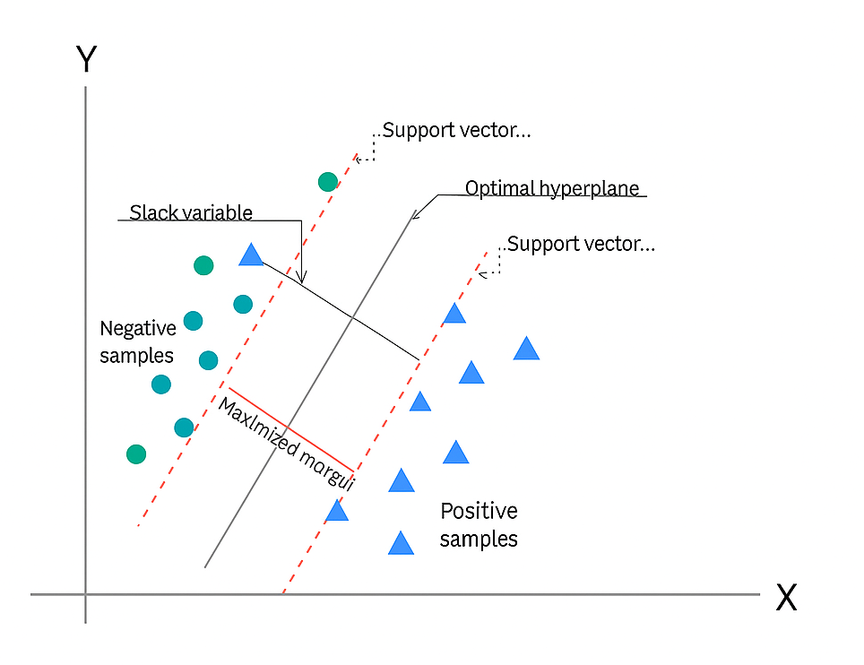

# Step 3: Model Training – RankSVM vs LightGBM

This section documents the training of two ranking models used in this project — RankSVM and LightGBM. Including their methodology, data preparation, training workflow, and evaluation metrics.


## 0. Introduction

In search ranking tasks, Learning to Rank (LTR) algorithms are widely used to optimize relevance based on user feedback or labels. This project uses pairwise-labeled data derived from user behavior, and trains two classic ranking models:

- **RankSVM** (a linear pairwise ranking model)
- **LightGBM** (a non-linear tree-based ranking model)


## 1. Overview of Ranking Approaches

Traditional information retrieval (IR) models rank query-document relevance using only a small set of manually designed factors. Classic ranking formulas typically rely on features such as term frequency (TF), inverse document frequency (IDF), and document length. However, as search engines have evolved, the number of factors affecting a webpage’s rank has grown significantly. For example, features like a page’s PageRank score, the number of matched words between the query and the document, and the length of a URL can all impact its position in the result list. Google's ranking algorithm reportedly considers over 200 such factors, which makes manual tuning infeasible and opens the door for machine learning-based solutions.

In supervised machine learning, training a ranking model typically requires large amounts of labeled data. Manually labeling such data at scale is impractical. Fortunately, search engines naturally generate implicit relevance signals through user interactions. For example, when a user submits a query and clicks on one of the returned links, we can reasonably assume that the clicked page is more relevant to the query than the ones that were skipped. While this assumption is not always accurate, experience has shown that using user click logs as weak supervision can be an effective proxy for training ranking models.

In short, ranking in the IR domain aims to order documents by relevance to a given query. As the number of relevance-affecting features increases, traditional heuristics become inadequate. Learning to Rank (LTR) addresses this by learning ranking functions automatically from data. In our project, we adopt this approach: Step 1 generates weak supervision labels from user behavior logs, forming the basis for the ranking models developed in later stages.


### Common Learning to Rank Paradigms:

Learning to Rank (LTR) algorithms are generally categorized into three paradigms based on how the training data is labeled: **Pointwise**, **Pairwise**, and **Listwise** approaches.

| Type      | Description                                        |
|-----------|----------------------------------------------------|
| Pointwise | Treat ranking as regression or classification      |
| Pairwise  | Learn preferences between pairs of documents       |
| Listwise  | Directly optimize ranking quality metrics (e.g., NDCG) |

#### 1. Pointwise Approaches

In pointwise methods, each query-document pair is treated independently and assigned an absolute relevance label. These labels can be:

- **Binary**: e.g., relevant vs. non-relevant
- **Multi-grade**: e.g., Perfect, Excellent, Good, Fair, Bad — with typically only the top few categories considered relevant

**Advantages:**

- Efficient to annotate: O(n) annotations for n documents
- Simple model structure: Often reduced to regression or classification tasks

**Disadvantages:**

- Annotation can be subjective and inconsistent across annotators
- Ignores the relative ranking among documents

#### 2. Pairwise Approaches

Pairwise methods consider the relative preference between two documents for the same query. A model is trained to predict which of the two documents should be ranked higher:

- Example: For a query `q`, if document `d1` is more relevant than `d2`, the pair is labeled as `(q, d1) ≻ (q, d2)`

**Advantages:**

- Easier to annotate than absolute labels; human raters are often more consistent when comparing two items
- Directly targets the ranking problem

**Disadvantages:**

- Annotation complexity increases quadratically: O(n²) comparisons for n documents
- Does not consider the full ranking list during training

#### 3. Listwise Approaches

Listwise methods view the entire ranked list as a single training instance. The model is trained to produce an ordering that closely matches an ideal (human-annotated) ranking.

**Advantages:**

- Aligns directly with ranking metrics such as NDCG or MAP
- Usually achieves better empirical performance on ranking tasks

**Disadvantages:**

- Extremely costly to annotate: annotators must sort an entire list
- Sensitive to annotation inconsistencies

In this project, we adopt the **pairwise approach**, as it provides a balance between annotation efficiency and learning effectiveness. Our weak supervision signals are generated from user clicks, which naturally yield pairwise preferences without requiring manual labeling.


## 2. RankSVM Model

### 2.1 The Core Idea Behind RankSVM

The core idea of **RankSVM** is to transform a **ranking problem into a pairwise classification problem**, and then solve it using an SVM classifier.

#### Transforming Ranking into Classification

For a given query-document pair, we represent each document using a feature vector $\mathbf{x}$. We use a scoring function $f(x)$ to determine the relative order of documents: the document with the higher score is ranked ahead of the one with the lower score. In other words, 

> if $f(x_i) > f(x_j)$, then $x_i$ should be ranked before $x_j$, and vice versa.


To simplify, we assume a **linear scoring function**:

$$
f(x) = \langle \mathbf{w}, x \rangle
$$

This leads to the equivalent form:

$$
f(x_i) > f(x_j) \iff \langle \mathbf{w}, x_i - x_j \rangle > 0
$$

We can then construct a binary classification problem using the feature difference $x_i - x_j$, and assign a label $y$ as:

$$
y =
\begin{cases}
+1, & \text{if } x_i \succ x_j \\
-1, & \text{if } x_i \prec x_j
\end{cases}
$$

*$x_i \succ x_j$ means $x_i$ should be ranked before $x_j$*

The classification condition becomes:
$$
y \cdot \langle \mathbf{w}, x_i - x_j \rangle > 0
$$

#### Solving with an SVM Model

Once transformed into a classification task, we can apply standard classification models like **Linear SVM**, or extend to **Nonlinear SVM** using kernels.

Given a set of query-document pairs, where documents are ranked by relevance, we can form training data as follows:

- **Positive samples**: feature differences such as $ x_1 - x_2, x_1 - x_3, x_2 - x_3 $
- **Negative samples**: reverse order differences $ x_2 - x_1, x_3 - x_1, x_3 - x_2 $

> When forming training pairs, use only pairs from the **same query**

#### Optimization in the SVM Model

After conversion, we optimize the model using the standard SVM formulation.

The primal formulation of a traditional SVM problem is:

$$
\min_{\mathbf{w}, \boldsymbol{\xi}} \frac{1}{2} \mathbf{w}^T \mathbf{w} + C \sum_{i=1}^{N} \bar{\xi}_i
$$

$$
\text{subject to } y_i \mathbf{w}^T \phi(\mathbf{x}_i) \geq 1 - \bar{\xi}_i,\quad \bar{\xi}_i \geq 0,\quad i = 1, \dots, N
$$

Primal Formulation for Rank SVM:

$$
\min_{\mathbf{w}, \boldsymbol{\xi}} \frac{1}{2} \mathbf{w}^T \mathbf{w} + C \sum_{(i,j) \in P} \xi_{i,j}
$$

$$
\text{subject to } \mathbf{w}^T \left( \Phi(\mathbf{x}_i) - \Phi(\mathbf{x}_j) \right) \geq 1 - \xi_{i,j},\quad \xi_{i,j} \geq 0,\quad \forall (i,j) \in P
$$

By introducing slack variables to incorporate the constraints into the original optimization problem, it can be further transformed into an unconstrained optimization problem.

$$
\min_{\mathbf{w}} \sum_{i=1}^N \left[ 1 - y_i \langle \mathbf{w}, x_i^{(1)} - x_i^{(2)} \rangle \right]_+ + \lambda \| \mathbf{w} \|^2
$$

- The first term is the **hinge loss**
- The second term is a **regularization** term

Convert the primal to the dual:

$$
\max_{\alpha} -\frac{1}{2} \sum_{i=1}^N \sum_{j=1}^N \alpha_i \alpha_j y_i y_j \langle x_i^{(1)} - x_i^{(2)}, x_j^{(1)} - x_j^{(2)} \rangle + \sum_{i=1}^N \alpha_i
$$

$$
\text{s.t. } \sum_{i=1}^N \alpha_i y_i = 0, \quad 0 \leq \alpha_i \leq C
$$

Final decision function after solving the corresponding model parameters is:

$$
f(x) = \sum_{i=1}^N \alpha_i^* y_i \langle x_i^{(1)} - x_i^{(2)}, x \rangle
$$

This function \( f(x) \) outputs a score used to rank documents under a given query.

#### Geometric Intuition

A key question in understanding RankSVM is: **which distance is it trying to maximize?**  
According to the paper *"An Efficient Method for Learning Nonlinear Ranking SVM Functions"*, the answer is:

> RankSVM maximizes the margin between the hyperplane and the *closest pairwise difference vector* $ \Phi(x_i) - \Phi(x_j) $.

This margin corresponds to the minimum distance from a pairwise difference vector to the separating hyperplane. By maximizing this minimum margin, RankSVM ensures that the learned ranking function can reliably preserve the ordering  $f(x_i) > f(x_j)$ over a wide range of document pairs.

We can treat the difference $ f(x_i) - f(x_j) $ as a single entity—a new vector in space. This allows us to reinterpret the ranking problem as a standard SVM classification problem on these difference vectors.



In this view, **RankSVM learns a weight vector $ \mathbf{w} $** such that the margin between the separating hyperplane and the **closest** difference vector (e.g.,  $ x_1 - x_2 $) is maximized.

This is illustrated in the figure above:  
- The support vectors are the pairs like $ x_1 - x_2 $, and others near the margin boundary.
- Once $\mathbf{w}$ is learned from this optimization, the decision function naturally follows:
  
$$
h(x) = \mathbf{w}^T \Phi(x)
$$

This function can then be used to score and rank documents based on their learned relevance.


### 2.2 Algorithm Overview

RankSVM reformulates ranking as a binary classification task:

- For a document pair (A, B) under the same query, if A is more relevant, label = 1, else -1
- Trained using hinge loss to maximize margin between relevant and non-relevant documents

### 2.3 Data Processing

Implemented in `process_data_for_ranksvm()`:

- Extracts feature vectors from raw data
- Constructs training pairs for each query
- Saves data in NumPy format for efficient loading

### 2.4 Model Training

Implemented using `LinearSVC(dual=False)`:

- Grid search is used to tune the `C` parameter
- 5-fold cross-validation is performed to evaluate generalization

Example command:

```bash
python -m src.models.ranksvm -tune
```

### 2.5 Evaluation and Visualization

- Accuracy and NDCG@60 are used as primary evaluation metrics
- Top-K ranking predictions can be visualized for qualitative inspection


## 3. LightGBM Model

### 3.1 The Core idea behind LightGBM

Gradient Boosted Decision Trees (GBDT) is a boosting algorithm based on additive models and forward stagewise optimization.  
It builds an ensemble of decision trees by optimizing a specified loss function, where each tree attempts to fit the residual or gradient of the previous trees.

- For classification tasks, cross-entropy loss is typically used.
- For regression tasks, mean squared error is commonly used.

#### Key Innovations in LightGBM


##### Leaf-wise Growth Strategy

In decision trees, LightGBM prioritizes splitting the leaf node that achieves the maximum gain (loss reduction), rather than growing all nodes at the same level.

While level-wise growth is more structured and easier to parallelize, leaf-wise growth often results in better accuracy and model performance.

For each tree, the training objective is to minimize the following function:

$$
L = \sum_{i=1}^{n} l(y_i, f(x_i)) + \Omega(f)
$$

Where:

- $l(y, f(x))$ is the loss function (e.g., squared error or cross-entropy),
- $\Omega(f)$ is a regularization term to prevent overfitting,
- Gain is computed for each split, and the one with the highest gain is selected.

#### Histogram-based Algorithm

Instead of computing split gains on all raw feature values (which is computationally expensive), LightGBM discretizes features into `k` bins (histograms).  
For each bin, the average value is used, significantly reducing the number of gain computations.

#### Gradient-based One-Side Sampling (GOSS)

GOSS accelerates training by:

- Keeping all samples with large gradients (which contribute more to learning),
- Randomly sampling from the small-gradient samples.

For example:

- Keep `a%` of large-gradient samples,
- Randomly sample `b%` from the small-gradient group.

This reduces computational cost while maintaining accuracy.

#### Exclusive Feature Bundling (EFB)

High-dimensional datasets often contain many sparse features. These features usually have non-zero values in different samples, meaning they are mutually exclusive.

LightGBM takes advantage of this by bundling mutually exclusive features into a single feature, reducing dimensionality.

- This decreases memory and computational requirements,
- It has minimal impact on model performance.


### 3.2 Algorithm Overview

LightGBM supports ranking objectives such as `lambdarank`:

- Boosted decision tree framework
- Group-wise loss that directly optimizes NDCG

### Data Process
Before training a LightGBM model, we must first load and preprocess the data into a format that LightGBM understands. Specifically, we use the `lightgbm.Dataset` class, which wraps the training features, labels, and optional group information for ranking tasks.

We provide custom preprocessing functions to convert raw ranking data (e.g., LETOR format) into LightGBM-compatible inputs. This step ensures proper group structure and sparse feature formatting for optimal ranking performance.

#### Preprocessing Pipeline Overview

1. **Raw Input Format**  
   Each data sample includes:
   - Relevance label (e.g., `0`, `1`, `2`)
   - Query ID (`qid`)
   - Sparse features in `index:value` format
   - Optional metadata (e.g., document ID)

2. **Output Files Required by LightGBM Ranking**  
   - `feats.txt`: Training features in SVMlight format  
   - `group.txt`: Query group sizes (one integer per query group)


#### Functions Used for Data Processing

1. `split_data_from_keyword(data_read, data_group, data_feats)`
Parses space-separated raw CSV data and writes:
- `data_feats`: one line per training sample with label and features
- `data_group`: number of samples per query group

Useful when your dataset uses keyword/group IDs explicitly in the second column.

2. `process_data_format(test_path, test_feats, test_group)`
Processes standard LETOR-format input files and generates:
- `test_feats`: filtered features
- `test_group`: query group sizes

Automatically handles:
- Query ID grouping (`qid`)
- Comment/metadata removal
- Zero-value feature filtering (for sparsity)

3. `save_data(group_data, output_feature, output_group)`
Helper to:
- Filter zero-value features
- Write a group of samples to output files

This function ensures input sparsity, reducing training cost for LightGBM.

4. `load_data(feats, group)`
Loads training data from:
- `feats.txt`: SVMlight format features and labels
- `group.txt`: query group sizes

Returns:
- `x_train`: sparse feature matrix  
- `y_train`: label vector  
- `q_train`: group sizes (1D array)

5.`load_data_from_raw(raw_data)`
Loads and parses raw test data in LETOR or similar format.  
Also extracts query IDs and any comment fields (e.g., document metadata).


#### Sample Output Structure

```txt
feats.txt
---------
2 1:0.1 2:0.8 4:0.3
1 1:0.0 3:0.6 5:0.7
...

group.txt
---------
4
5
7
```

Each number in `group.txt` indicates how many samples belong to a query group in `feats.txt`, in order.

#### Notes
- Grouping information is **mandatory** for ranking objectives such as `lambdarank`, `rank_xendcg`, etc.
- The sparse SVMlight format is compatible with both `lightgbm.Dataset` and `sklearn.datasets.load_svmlight_file`.
- Removing zero-value features improves efficiency, especially on large-scale or high-dimensional data.


### 3.3 Model Training Command

Train baseline LightGBM:

```bash
python -m src.models.lightgbm -train
```

Train LightGBM with neural feature extractor:

```bash
python -m src.models.lightgbm -train_nn
```

### 3.4 Evaluation and Visualization

- Evaluated using NDCG@60:

```bash
python -m src.models.lightgbm -ndcg
python -m src.models.lightgbm -ndcg_nn
```

- Feature importance can be visualized using LightGBM’s built-in `plot_importance`


## 4. Comparison and Summary

| Model         | Characteristics              | Pros                         | Cons                           |
|---------------|------------------------------|------------------------------|--------------------------------|
| RankSVM       | Linear pairwise model        | Simple, interpretable        | Limited capacity               |
| LightGBM      | GBDT with lambdarank         | High accuracy, non-linear    | Harder to tune, larger model  |
| LightGBM + NN | MLP + GBDT hybrid            | Combines expressive & robust | Slower training, less interpretable |


## 5. Appendix

- **Model serialization**: using `joblib` or `pickle`
- **Common errors**: e.g., sparse/dense conversion, dimension mismatch
- **Sample predictions**: Top-K results from each model
- **File structure and functions**: Explained with code comments and usage examples
